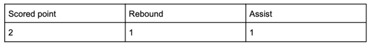
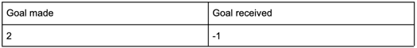

# Most Valuable Player (Code Test)
## General info
Tucan Tournament is a tournament where several players compete in several sports. Right now, the sports played are basketball and handball games. They plan to add more sports in the future.
Created a program to calculate the Most Valuable Player (MVP) of the tournament.
A set of CSV files located in resources/gamesdata, each one containing the stats of one game. Each file starts with a row indicating the sport it refers to.
Each player is assigned a unique nickname.
Each file represent a single game.
The MVP is the player with the most rating points, adding the rating points in all games.
A player will receive 10 additional rating points if their team won the game.
Every game must have a winner team.
One player may play in different teams and positions in different games, but not in the same game.

The program responsible for generating the files has a bug, that can be reflected in wrong files format. If one file is wrong, the whole set of files is considered to be wrong and the MVP won’t be calculated.

For now application supports only basketball and handball games with score calculating formulas:
- basketball: 
- handball: 

### Extending
If you need to add any other game:
- add new related PlayerData class similar to BasketballPlayerData, HandballPlayerData;
- add new game into GameType enum.